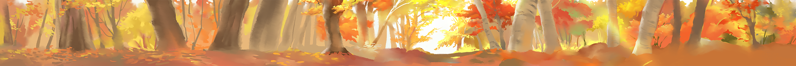
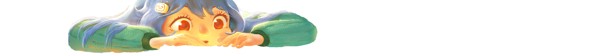
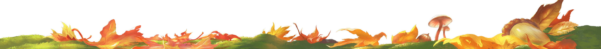
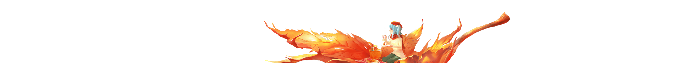
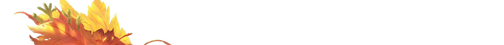

# 从 B 站的秋季主题中学习 “图层组合动画”

大家好，我们是明源云前端团队。

众所周知，[B 站](https://www.bilibili.com/) 是个适合学习的好网站，我们团队的小伙伴也是经常上 `B站` 学习。

某一天在 `B站` 学习的时候，发现 `B站` 已经开启了秋季主题，并且在头图的这个交互上还内有乾坤。随着我们的鼠标变换位置，头图也跟随着我们的鼠标位置进行变换，配上秋季主题，显得特别治愈。（如下图）


小编对这个交互也是挺感兴趣的，那接下来我们直接进入主题，来试着实现这种动画效果吧！

## 原理分析

我们先进行实现原理分析，打开控制台，可以发现这个效果是通过几个图层变换位置和高斯模糊来实现的（如下图）


除此之外，还有个小女孩的 `眨眼` 特效，是通过切换图片来实现的。所以我们实现的步骤分解为四步：

1. 获取对应的图片；
2. 将图片按照效果图，摆放在对应的位置，设置默认的高斯模糊；
3. 通过切换图片制作 `眨眼` 特效；
4. 根据鼠标位置切换图片位置和高斯模糊；

那我们遵循上面的步骤，开始制作吧！

## 获取图片

首先，我们打开控制台（F12），在控制台输入下面这行代码来获取图片。

```js
var images = document.querySelectorAll(".animated-banner .layer img");
var urlList = [].slice.call(images).map((item) => item.src);
console.log(JSON.stringify(urlList, null, 2));
```


如上图所示，我们将这几张图片下载到自己的电脑中（如下图）


还有个动画轮播图，我们使用下面这行代码来获取不同的几张图片。

```js
var animateImgList = [];
setInterval(() => {
  var imgSrc = document.querySelector(
    ".animated-banner >.layer:nth-child(2) img"
  ).src;
  if (!animateImgList.includes(imgSrc)) {
    console.log(imgSrc);
    animateImgList.push(imgSrc);
  }
}, 200);
```


如上图所示，我们可以得到几张不同状态的图片，我们下载到自己的电脑里即可。

## 摆放图片

我们下载的几张图片都是 `png` 格式的，我们可以使用定位将其堆叠到一起。

直接新建一个 `index.html`，填充内容如下：

```html
<!DOCTYPE html>
<html lang="en">
  <head>
    <meta charset="UTF-8" />
    <meta name="viewport" content="width=device-width,initial-scale=1.0" />
    <title>Document</title>
  </head>
  <style>
    * {
      margin: 0;
      padding: 0;
    }
    .img-list {
      width: 100%;
      min-width: 1000px;
      height: 155px;
      position: relative;
      overflow: hidden;
    }
    .img-list .layer {
      position: absolute;
      left: 0;
      top: 0;
      width: 100%;
      height: 100%;
      display: flex;
      align-items: center;
      justify-content: center;
    }
  </style>
  <body>
    <section class="img-list">
      <div class="layer">
        
      </div>
      <div class="layer">
        
      </div>
      <div class="layer">
        
      </div>
      <div class="layer">
        
      </div>
      <div class="layer">
        
      </div>
      <div class="layer">
        
      </div>
    </section>
  </body>
</html>
```

上面做了简单的图片排列，实现的效果如下图所示：


从上图可以看出，我们将多张图片堆叠后，已经有初步的雏形了，接下来我们来设置默认的高斯模糊吧。

由于我们的位置偏移和高斯模糊在后面需要涉及到交互，所以我们直接使用 `JS` 进行设置，这里我们借助一下 `Jquery`，在 `body` 后引入 `jquery`，然后写入我们的 `javascript` 脚本（如下）。

```html
<script src="https://cdn.bootcdn.net/ajax/libs/jquery/1.10.0/jquery.js"></script>
<script>
  const imgList = $(".img-list .layer img");
  // 默认的位置偏移与高斯模糊值
  const defaultStyles = [
    { translateX: 0, translateY: 0, blur: 4 },
    { translateX: 0, translateY: 0, blur: 0 },
    { translateX: -50, translateY: 0, blur: 1 },
    { translateX: 0, translateY: 4.2, blur: 4 },
    { translateX: 0, translateY: -1.8, blur: 5 },
    { translateX: 0, translateY: 0, blur: 6 },
  ];

  function setDefaultImgStyle() {
    for (let i = 0; i < imgList.length; i++) {
      const imgItem = imgList[i];
      const defaultStyle = defaultStyles[i];
      const { translateX, translateY, blur } = defaultStyle;
      // 设置位置偏移以及高斯模糊
      $(imgItem).css({
        // 位置偏移
        transform: `translate(${translateX}px, ${translateY}px)`,
        // 高斯模糊
        filter: `blur(${blur}px)`,
      });
    }
  }
  setDefaultImgStyle();
</script>
```

在设置好了位置偏移和高斯模糊后，我们的静态页面已经和效果图完全一致了（如下图）。


## 制作眨眼特效

我们的静态页面已经制作的差不多了，接下来我们来用 `JS` 简单实现 `眨眼` 特效吧。

这个比较简单，我们只需要设置一个定时器，每 3 秒切换一次图片集即可，代码实现如下：

```js
function setShakeAnimation() {
  // 第二张小女孩图片
  const imgGirl = $(".img-list .layer:nth-child(2) img");

  // 每 3 秒眨一次眼睛
  setInterval(() => {
    // 半闭眼
    $(imgGirl).attr("src", "./assets/2_2.png");

    // 100 毫秒后完全闭上眼眼睛
    setTimeout(() => {
      $(imgGirl).attr("src", "./assets/2_3.png");
    }, 100);

    // 300 毫秒后半睁开眼睛
    setTimeout(() => {
      $(imgGirl).attr("src", "./assets/2_2.png");
    }, 300);

    // 400 毫秒后完全睁开眼睛
    setTimeout(() => {
      $(imgGirl).attr("src", "./assets/2_1.png");
    }, 400);
  }, 3000);
}
setShakeAnimation();
```

然后，我们来看看我们的 `眨眼` 特效吧！（如下图）


如上图所示，我们的 `眨眼` 特效已经可以做到以假乱真啦！

## 动态交互

最后，我们来为我们的图层合集添加上交互效果吧！

我们从 `B站` 原有的交互中可以发现，当我们把鼠标放上去左右移动时，图片发生了位置和高斯模糊度的变化。所以我们先把鼠标移动的事件监听加上，代码实现如下：

```js
// 屏幕宽度
const width = document.body.clientWidth;
// 鼠标进入的事件
$(".img-list").mouseenter((e) => {
  // 鼠标离开时解除事件监听，并重置状态
  $(".img-list").mouseleave(() => {
    setDefaultImgStyle();
    $(".img-list").off("mousemove");
    $(".img-list").off("mouseleave");
  });

  // 鼠标进入时记录位置
  const originalX = e.pageX;
  $(".img-list").mousemove((e) => {
    // 鼠标移动时记录位置
    const currentX = e.pageX;
    // 根据屏幕宽度和移动距离，计算移动的比例
    const offsetRatio = (currentX - originalX) / width;
    // 鼠标左移
    if (offsetRatio < 0) {
      setLeftImgStyle(Math.abs(offsetRatio));
      // 鼠标右移
    } else {
      setRightImgStyle(offsetRatio);
    }
  });
});
```

接下来，我们经过大致测量一下后会发现，高斯模糊变化的效果如下表所示。

| 图片序号 | 初始值（高斯模糊值） | 从最右侧到最左侧（高斯模糊值） | 从最左侧到最右侧（高斯模糊值） |
| -------- | -------------------- | ------------------------------ | ------------------------------ |
| 1        | 4                    | 4 -> 0                         | 4 -> 8                         |
| 2        | 0                    | 0 -> 10                        | 0 -> 8                         |
| 3        | 1                    | 1 -> 5                         | 1 -> 4                         |
| 4        | 4                    | 4 -> 13                        | 4 -> 0 -> 4                    |
| 5        | 5                    | 5 -> 14                        | 5 -> 0 -> 4                    |
| 6        | 6                    | 6 -> 12                        | 6 -> 0                         |

位置变化的效果如下表所示。

| 图片序号 | 初始值（X 轴位置） | 从最右侧到最左侧（X 轴位置） | 从最左侧到最右侧（X 轴位置） |
| -------- | ------------------ | ---------------------------- | ---------------------------- |
| 1        | 0                  | 0                            | 0                            |
| 2        | 0                  | -9                           | 9                            |
| 3        | -50                | -80                          | 21                           |
| 4        | 0                  | -36                          | 35                           |
| 5        | 0                  | -78                          | 77                           |
| 6        | 0                  | -97                          | 96                           |

根据上面两张表，我们就可以开始写代码啦，代码实现如下：

```js
// 鼠标左移后的最终目标位置
const leftStyles = [
  {
    translateX: 0,
    translateY: 0,
    blur: 0,
  },
  {
    translateX: -9,
    translateY: 0,
    blur: 10,
  },
  {
    translateX: -80,
    translateY: 0,
    blur: 5,
  },
  {
    translateX: -36,
    translateY: 4.2,
    blur: 13,
  },
  {
    translateX: -78,
    translateY: -1.8,
    blur: 14,
  },
  {
    translateX: -97,
    translateY: 0,
    blur: 12,
  },
];

function setLeftImgStyle(offsetRatio) {
  for (let i = 0; i < imgList.length; i++) {
    const imgItem = imgList[i];
    const {
      translateX: defaultTranslateX,
      translateY: defaultTranslateY,
      blur: defaultBlur,
    } = defaultStyles[i];
    const leftStyle = leftStyles[i];
    // 根据移动比例计算最终坐标和高斯模糊值
    const translateX =
      (leftStyle.translateX - defaultTranslateX) * offsetRatio +
      defaultTranslateX;
    const blur = (leftStyle.blur - defaultBlur) * offsetRatio + defaultBlur;

    // 设置位置偏移以及高斯模糊
    $(imgItem).css({
      // 位置偏移
      transform: `translate(${translateX}px, ${defaultTranslateY}px)`,
      // 高斯模糊
      filter: `blur(${blur}px)`,
    });
  }
}

// 鼠标右移后的最终目标位置
const rightStyles = [
  {
    translateX: 0,
    translateY: 0,
    blur: 8,
  },
  {
    translateX: 9,
    translateY: 0,
    blur: 8,
  },
  {
    translateX: 21,
    translateY: 0,
    blur: 4,
  },
  {
    translateX: 35,
    translateY: 4.2,
    blur: [0, 4],
  },
  {
    translateX: 77,
    translateY: -1.8,
    blur: [0, 4],
  },
  {
    translateX: 96,
    translateY: 0,
    blur: 0,
  },
];

function setRightImgStyle(offsetRatio) {
  for (let i = 0; i < imgList.length; i++) {
    const imgItem = imgList[i];
    const {
      translateX: defaultTranslateX,
      translateY: defaultTranslateY,
      blur: defaultBlur,
    } = defaultStyles[i];
    const rightStyle = rightStyles[i];
    let rightBlur = rightStyle.blur;
    let blur = defaultBlur;
    // 根据移动比例计算最终坐标和高斯模糊值
    const translateX =
      (rightStyle.translateX - defaultTranslateX) * offsetRatio +
      defaultTranslateX;
    if (Array.isArray(rightBlur)) {
      const targetBlur = offsetRatio < 0.5 ? rightBlur[0] : rightBlur[1];
      const ratio =
        offsetRatio < 0.5 ? offsetRatio * 2 : (offsetRatio - 0.5) * 2;
      const currentBlur = offsetRatio < 0.5 ? defaultBlur : rightBlur[0];
      blur = (targetBlur - currentBlur) * ratio + currentBlur;
    } else {
      blur = (rightBlur - defaultBlur) * offsetRatio + defaultBlur;
    }
    // 设置位置偏移以及高斯模糊
    $(imgItem).css({
      // 位置偏移
      transform: `translate(${translateX}px, ${defaultTranslateY}px)`,
      // 高斯模糊
      filter: `blur(${blur}px)`,
    });
  }
}
```

在上面的代码实现中，我们在鼠标左移右移的过程中添加了图片位置偏移与高斯模糊值，最后我们实现的效果就和 `B站` 的原版很相近了！（如下图）


好了，大功告成啦！

## 总结

经过简单的步骤分析，我们将几张图片组合起来就模拟出了 `B站` 的秋季主题效果啦！

这个案例是在某次学习（发呆）的时候发现 `B站` 的秋季主题挺有意思的，这里分享出来给大家，用几张图片组合出这么一个创意交互，也是挺有趣的~

## 求贤若渴

明源云链前端团队是个充满激情的团队，明源云也是对技术非常重视的公司。

我们有完善的福利：六险一金 +（丰厚）年终奖 + 带薪休假 + 通讯补贴

我们的工作氛围：弹性工作，扁平结构，崇尚以解决问题为核心、简单高效的互联网文化，鼓励技术创新分享，每年举办黑客马拉松（最高奖 3W 奖金）、极客大赛、移动社群等技术性赛事

我们有人文关怀：花式下午茶（每周都有）、生日礼金、免费旅游、活动经费、结婚礼金、免费体检

我们还有丰富的业余社团活动：篮球、足球、瑜伽、羽毛球、台球、棋牌赛

我们招聘的岗位有：`（中高级）前端工程师`、`（中高级）测试工程师`、`（中高级）Java 工程师`、`（中高级）PHP 工程师`。

Base：`深圳`、`武汉`。

欢迎投递简历到邮箱 `lit31@mingyuanyun.com`，或者添加下面微信备注 `明源云` 进行咨询吧！


